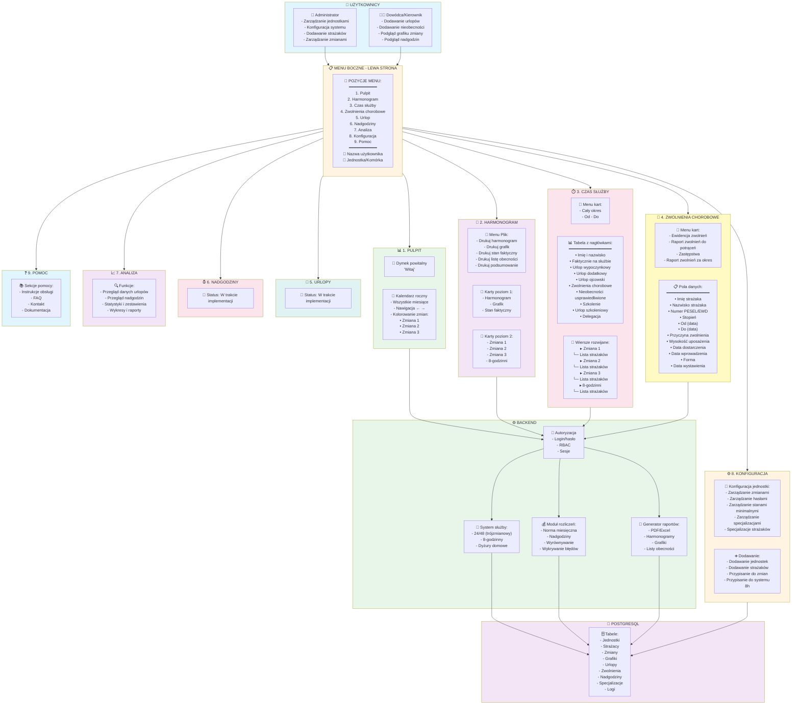

🚒 SPECYFIKACJA APLIKACJI: SYSTEM EWIDENCJI CZASU SŁUŻBY STRAŻAKÓW
1. Cel systemu
Celem aplikacji jest stworzenie kompleksowego narzędzia do ewidencji czasu służby strażaków dla jednostek PSP i OSP, obejmującego planowanie grafików, rozliczanie godzin, nadgodzin, urlopów, nieobecności, prowadzenie dokumentacji oraz generowanie raportów w formacie PDF/Excel. System ma usprawnić pracę dowódców, kadr oraz samych strażaków, zapewniając przejrzystość i automatyzację procesów.

2. Użytkownicy i role
2.1 Administrator systemu
zarządza jednostkami, strażakami, strukturą organizacyjną,
ustala ustawienia globalne (normy godzinowe, typy służb, uprawnienia),
może edytować wszystko.

2.2 Dowódca / Kierownik
tworzy i zatwierdza grafiki służb,
zarządza podwładnymi,
dodaje urlopy, nieobecności, dyżury, wyjazdy szkoleniowe,
generuje raporty miesięczne.
podgląd grafiku całej zmiany lub komórki organizacyjnej,
podgląd normy godzinowej i nadgodzin,
otrzymuje powiadomienia.
eksport danych do systemów zewnętrznych.

3. Model czasu służby i rozliczeń
3.1 Obsługiwane systemy pracy:
24/48 (standard PSP),
służba codzienna 8-godzinna,
dyżury domowe,
system mieszany.

3.2 Elementy podlegające ewidencji:
służby pełne,
służby skrócone,
nadgodziny,
dyżury,
urlopy:
wypoczynkowe,
okolicznościowe,
L4,
szkoleniowe,
kursy,
KPP / poligon / zawody,
odpracowania.

3.3 Automatyczne rozliczanie:
wyliczanie normy miesięcznej,
rozliczanie nadgodzin zgodnie z zasadami PSP,
wyrównywanie godzin,
wykrywanie błędów (np. "strażak wpisany na dwóch służbach jednocześnie").

4. Funkcjonalności systemu
4.1 Planowanie grafików
widok miesięczny dla całej JRG,
przeciąganie i upuszczanie służb (drag&drop),
kopiowanie grafików między miesiącami,
szybkie zamiany strażaków,
wersjonowanie grafiku (propozycja → zatwierdzenie).

4.2 Ewidencja zdarzeń i nieobecności
rejestr urlopów,
rejestr zwolnień lekarskich,
rejestr szkoleń i delegacji,
obsługa dyżurów domowych.

4.3 Panel strażaka
podgląd swojego harmonogramu,
historia urlopów i nadgodzin,
powiadomienia o zmianach w grafiku,
składanie wniosków (urlop, zamiana służb, odpracowanie).

4.4 Raportowanie
raport miesięczny do zatwierdzenia przez dowódcę,
raport roczny,
zestawienia godzin służb, nadgodzin, urlopów,
eksport PDF/Excel,
raporty dla PSP, KW, KG.

4.5 Integracje (opcjonalne)
import danych z systemów kadrowych,
integracja z RCP (rejestr wejść/wyjść),
integracja z systemami alarmowania.

4.6 Powiadomienia
e-mail / SMS (opcjonalnie),
powiadomienia web push,
alerty o błędach w grafiku.

5. Technologia i architektura
5.1 Frontend
React / Next.js,
mobilna responsywność,
możliwość stworzenia aplikacji mobilnej (Android).

5.2 Backend
Node.js / NestJS
 lub
Python / Django
 lub
Laravel (PHP)

Backend zapewnia:
logikę rozliczania godzin,
bezpieczeństwo danych,
zarządzanie uprawnieniami.

5.3 Baza danych
PostgreSQL (zalecana),
dane szyfrowane.

5.4 API
REST lub GraphQL,
możliwość integracji z systemami zewnętrznymi.

6. Bezpieczeństwo
szyfrowanie danych (w tym haseł),
kopie zapasowe,
role i uprawnienia oparte na RBAC,
logowanie aktywności systemowej.

7. Dostęp i logowanie
login + hasło,
opcjonalnie SSO (Microsoft/Google),
ograniczenia IP dla stanowisk kadrowych / dowódczych.

8. Moduły dodatkowe (opcjonalnie)
terminarz badań lekarskich i szkoleń,

9. Widoki aplikacji
9.1 Dashboard
dzisiejsze służby,
nadgodziny do rozliczenia,
nadchodzące urlopy,
ostrzeżenia o błędach.

9.2 Grafik służb
kalendarz miesięczny,
kolory: służba, wolne, dyżur, urlop, L4 itd.

9.3 Panel dowódcy
lista strażaków,
szybkie statystyki,
raporty.
podgląd grafiku

Diagram graficzny

