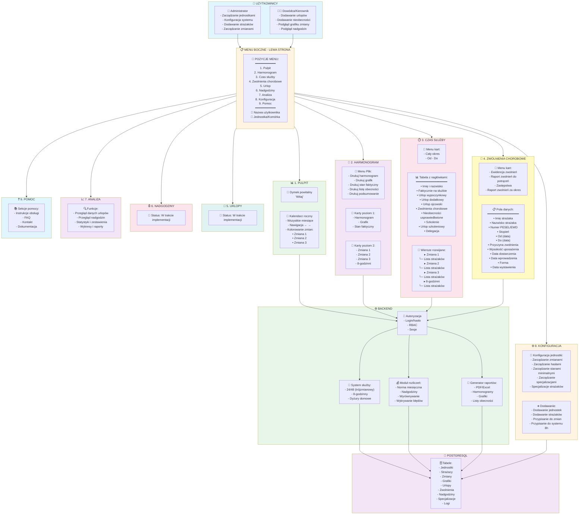

Diagram graficzny

```mermaid
 graph TB
    subgraph Users["👥 UŻYTKOWNICY"]
        Admin["🔧 Administrator<br/>- Zarządzanie jednostkami<br/>- Konfiguracja systemu<br/>- Dodawanie strażaków<br/>- Zarządzanie zmianami"]
        Dowodca["👨‍✈️ Dowódca/Kierownik<br/>- Dodawanie urlopów<br/>- Dodawanie nieobecności<br/>- Podgląd grafiku zmiany<br/>- Podgląd nadgodzin"]
    end

    subgraph LeftMenu["📋 MENU BOCZNE - LEWA STRONA"]
        MenuItems["📍 POZYCJE MENU:<br/>━━━━━━━━━━━<br/>1. Pulpit<br/>2. Harmonogram<br/>3. Czas służby<br/>4. Zwolnienia chorobowe<br/>5. Urlop<br/>6. Nadgodziny<br/>7. Analiza<br/>8. Konfiguracja<br/>9. Pomoc<br/>━━━━━━━━━━━<br/>👤 Nazwa użytkownika<br/>🏢 Jednostka/Komórka"]
    end

    subgraph Pulpit["📊 1. PULPIT"]
        Powitanie["👋 Dymek powitalny<br/>'Witaj'"]
        Kalendarz["📅 Kalendarz roczny<br/>- Wszystkie miesiące<br/>- Nawigacja ← →<br/>- Kolorowanie zmian:<br/>  • Zmiana 1<br/>  • Zmiana 2<br/>  • Zmiana 3"]
    end

    subgraph Harmonogram["📅 2. HARMONOGRAM"]
        HarmMenu["📄 Menu Plik:<br/>- Drukuj harmonogram<br/>- Drukuj grafik<br/>- Drukuj stan faktyczny<br/>- Drukuj listę obecności<br/>- Drukuj podsumowanie"]
        HarmKarty["📑 Karty poziom 1:<br/>- Harmonogram<br/>- Grafik<br/>- Stan faktyczny"]
        HarmZmiany["👥 Karty poziom 2:<br/>- Zmiana 1<br/>- Zmiana 2<br/>- Zmiana 3<br/>- 8-godzinni"]
    end

    subgraph CzasSluzby["⏱️ 3. CZAS SŁUŻBY"]
        CzasMenu["📑 Menu kart:<br/>- Cały okres<br/>- Od - Do"]
        CzasTabela["📊 Tabela z nagłówkami:<br/>━━━━━━━━━━━━━━━━━<br/>• Imię i nazwisko<br/>• Faktycznie na służbie<br/>• Urlop wypoczynkowy<br/>• Urlop dodatkowy<br/>• Urlop ojcowski<br/>• Zwolnienia chorobowe<br/>• Nieobecności usprawiedliwione<br/>• Szkolenie<br/>• Urlop szkoleniowy<br/>• Delegacja"]
        CzasRozwijane["🔽 Wiersze rozwijane:<br/>▸ Zmiana 1<br/>  └─ Lista strażaków<br/>▸ Zmiana 2<br/>  └─ Lista strażaków<br/>▸ Zmiana 3<br/>  └─ Lista strażaków<br/>▸ 8-godzinni<br/>  └─ Lista strażaków"]
    end

    subgraph Zwolnienia["🏥 4. ZWOLNIENIA CHOROBOWE"]
        ZwolKarty["📑 Menu kart:<br/>- Ewidencja zwolnień<br/>- Raport zwolnień do potrąceń<br/>- Zastępstwa<br/>- Raport zwolnień za okres"]
        ZwolTabela["📋 Pola danych:<br/>━━━━━━━━━━━━━━━━━<br/>• Imię strażaka<br/>• Nazwisko strażaka<br/>• Numer PESEL/EWD<br/>• Stopień<br/>• Od (data)<br/>• Do (data)<br/>• Przyczyna zwolnienia<br/>• Wysokość uposażenia<br/>• Data dostarczenia<br/>• Data wprowadzenia<br/>• Forma<br/>• Data wystawienia"]
    end

    subgraph Urlopy["🌴 5. URLOPY"]
        UrlopStatus["🔄 Status: W trakcie implementacji"]
    end

    subgraph Nadgodziny["⏰ 6. NADGODZINY"]
        NadgodzinyStatus["🔄 Status: W trakcie implementacji"]
    end

    subgraph Analiza["📈 7. ANALIZA"]
        AnalizaOpis["🔍 Funkcje:<br/>- Przegląd danych urlopów<br/>- Przegląd nadgodzin<br/>- Statystyki i zestawienia<br/>- Wykresy i raporty"]
    end

    subgraph Konfiguracja["⚙️ 8. KONFIGURACJA"]
        KonfJednostki["🏢 Konfiguracja jednostki:<br/>- Zarządzanie zmianami<br/>- Zarządzanie hasłami<br/>- Zarządzanie stanami minimalnymi<br/>- Zarządzanie specjalizacjami<br/>- Specjalizacje strażaków"]
        KonfDodawanie["➕ Dodawanie:<br/>- Dodawanie jednostek<br/>- Dodawanie strażaków<br/>- Przypisanie do zmian<br/>- Przypisanie do systemu 8h"]
    end

    subgraph Pomoc["❓ 9. POMOC"]
        PomocOpis["📚 Sekcje pomocy:<br/>- Instrukcje obsługi<br/>- FAQ<br/>- Kontakt<br/>- Dokumentacja"]
    end

    subgraph Backend["⚙️ BACKEND"]
        Auth["🔐 Autoryzacja<br/>- Login/hasło<br/>- RBAC<br/>- Sesje"]
        SystemSluzby["🔄 System służby:<br/>- 24/48 (trójzmianowy)<br/>- 8-godzinny<br/>- Dyżury domowe"]
        Rozliczenia["💰 Moduł rozliczeń:<br/>- Norma miesięczna<br/>- Nadgodziny<br/>- Wyrównywanie<br/>- Wykrywanie błędów"]
        Raporty["📄 Generator raportów:<br/>- PDF/Excel<br/>- Harmonogramy<br/>- Grafiki<br/>- Listy obecności"]
    end

    subgraph Database["💾 POSTGRESQL"]
        DB["🗄️ Tabele:<br/>- Jednostki<br/>- Strażacy<br/>- Zmiany<br/>- Grafiki<br/>- Urlopy<br/>- Zwolnienia<br/>- Nadgodziny<br/>- Specjalizacje<br/>- Logi"]
    end

    Admin --> LeftMenu
    Dowodca --> LeftMenu
    
    LeftMenu --> Pulpit
    LeftMenu --> Harmonogram
    LeftMenu --> CzasSluzby
    LeftMenu --> Zwolnienia
    LeftMenu --> Urlopy
    LeftMenu --> Nadgodziny
    LeftMenu --> Analiza
    LeftMenu --> Konfiguracja
    LeftMenu --> Pomoc
    
    Pulpit --> Auth
    Harmonogram --> Auth
    CzasSluzby --> Auth
    Zwolnienia --> Auth
    
    Auth --> SystemSluzby
    Auth --> Rozliczenia
    Auth --> Raporty
    
    SystemSluzby --> DB
    Rozliczenia --> DB
    Raporty --> DB
    
    Konfiguracja --> DB
    
    style Users fill:#e1f5ff
    style LeftMenu fill:#fff4e1
    style Pulpit fill:#e8f5e9
    style Harmonogram fill:#f3e5f5
    style CzasSluzby fill:#fce4ec
    style Zwolnienia fill:#fff9c4
    style Urlopy fill:#e0f2f1
    style Nadgodziny fill:#fce4ec
    style Analiza fill:#f3e5f5
    style Konfiguracja fill:#fff4e1
    style Pomoc fill:#e1f5ff
    style Backend fill:#e8f5e9
    style Database fill:#f3e5f5
```